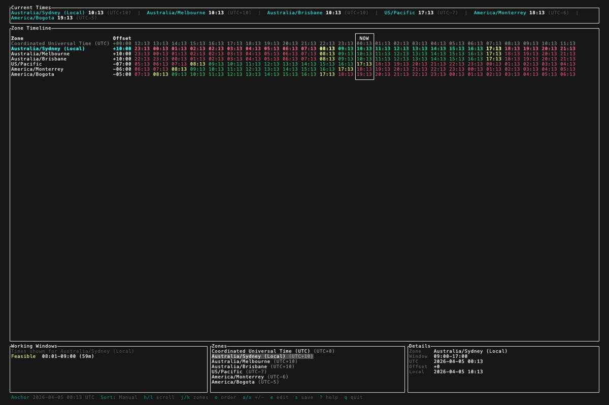
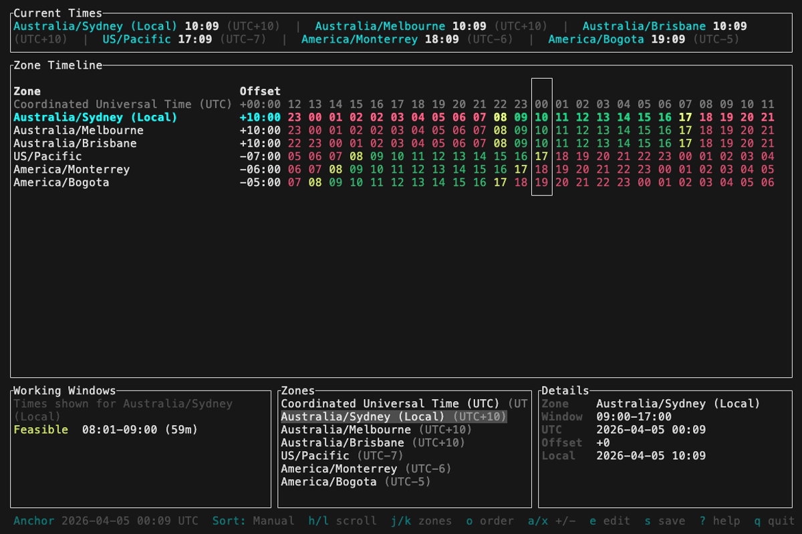
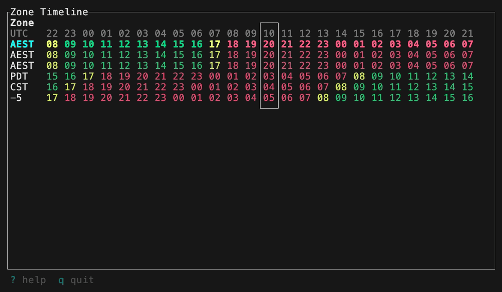

<p align="center">
  
</p>

# Zone Timeline (TUI)

[](https://github.com/findyourexit/zonetimeline-tui/actions)
[](https://github.com/findyourexit/zonetimeline-tui)
[](https://github.com/findyourexit/zonetimeline-tui/releases)
[](https://opensource.org/licenses/MIT)

A terminal tool for visually comparing time zones — built for distributed teams.

See at a glance where working hours overlap across zones, find meeting slots
without mental arithmetic, and manage your zone list interactively. Ships as a
single binary with both a rich TUI and a plain-text mode for scripts and pipes.

<p align="center">
  
</p>

## Quick Start

### Install It

<details>
<summary><strong>Homebrew (macOS)</strong></summary>

```bash
brew tap findyourexit/tap
brew install ztl
```

</details>

<details>
<summary><strong>Pre-Built Binaries</strong></summary>

Download the latest release for your platform from the
[GitHub Releases](https://github.com/findyourexit/zonetimeline-tui/releases) page.

Archives are provided for:
- macOS (Apple Silicon and Intel)
- Linux (`x86_64` and `aarch64`)
- Windows (`x86_64`)

</details>

<details>
<summary><strong>Build It Yourself</strong></summary>

### Source Build

```bash
cargo install --git https://github.com/findyourexit/zonetimeline-tui
```

### Local Build

```bash
git clone https://github.com/findyourexit/zonetimeline-tui.git
cd zonetimeline-tui
cargo build --release
# Binary is at target/release/ztl
```

</details>

### Run It

```bash
# Launch the TUI
ztl

# Plain text output
ztl --plain --zones UTC,Europe/London,America/New_York --time 07:30 --nhours 12

# List supported timezone names
ztl list
```

## Modes

| Flag / subcommand | Behaviour                               |
|-------------------|-----------------------------------------|
| *(none)*          | Launch the interactive TUI              |
| `--plain`         | Render a text timeline and exit         |
| `list`            | Print supported timezone names and exit |

- `--time` is interpreted in UTC and accepts both `HH` and `HH:MM`.
- An explicit time is applied to the current UTC date.
- `--width` sets the output width in columns.
- `--shoulder-hours` controls how many hours outside the work window are marked as shoulder time (default: 1).

### Compact Mode

<p align="center">
  
</p>

Compact Mode kicks in automatically when the terminal width drops below the
full layout threshold. It condenses the timeline while preserving all zone
rows, work-window shading, and keyboard navigation — ideal for split panes,
tiling window managers, or narrower displays.

### Micro Mode

<p align="center">
  
</p>

Micro Mode activates automatically when the terminal size is very small,
providing a streamlined layout optimised for mobile handsets and other
constrained terminal environments. It retains core functionality — zone
comparison, hour navigation, and work-window visibility — while fitting
comfortably in minimal screen real estate.

## TUI Controls

| Key                                                             | Action                      |
|-----------------------------------------------------------------|-----------------------------|
| <kbd>Left</kbd> / <kbd>Right</kbd>, <kbd>h</kbd> / <kbd>l</kbd> | Move hour focus             |
| <kbd>Up</kbd> / <kbd>Down</kbd>, <kbd>j</kbd> / <kbd>k</kbd>    | Move zone focus             |
| <kbd>a</kbd>                                                    | Add zone                    |
| <kbd>x</kbd>                                                    | Remove zone                 |
| <kbd>J</kbd> / <kbd>K</kbd>                                     | Reorder zone                |
| <kbd>e</kbd>                                                    | Edit work window            |
| <kbd>o</kbd>                                                    | Cycle sort mode             |
| <kbd>Enter</kbd>                                                | Submit modal input          |
| <kbd>Esc</kbd>                                                  | Cancel modal input          |
| <kbd>Tab</kbd>                                                  | Switch pane (in edit modal) |
| <kbd>s</kbd>                                                    | Save config                 |
| <kbd>?</kbd>                                                    | Help                        |
| <kbd>q</kbd>                                                    | Quit                        |

## Configuration

The primary config path is `<platform-config-dir>/zonetimeline-tui/config.toml`.
A legacy fallback at `<platform-config-dir>/zonetimeline/config` is also
supported.

Config discovery is asymmetric by design:

- Reads check the new config first, then fall back to the legacy path.
- Writes always target the new config unless `--config PATH` is specified.
- `--config PATH` acts as both the load override and the save target.
- TUI edits persist only on explicit save (`s`).

If no zones are provided via CLI or config, a default set is used:
`local`, `America/New_York`, `Europe/London`. The UTC row is always shown.

Zone merging follows per-field precedence:

- `--zones` overrides config `zones` only.
- `--zone` overrides config `zone` only.
- The two zone lists are concatenated in that order.

## Development

```bash
cargo fmt --check
cargo clippy --all-targets --all-features -- -D warnings
cargo test
```

See [CONTRIBUTING.md](CONTRIBUTING.md) for more details.

## Motivation

This tool was born out of a practical need: managing a distributed team of
engineers spread across distinct time zones around the globe. Finding good
mutual time slots for meetings and synchronous work shouldn't require mental
arithmetic or a web app — it should be a quick terminal command away.

No existing CLI tool quite fit the bill. The closest was the original
[`zonetimeline`](https://github.com/jvrsantacruz/zonetimeline) by
[@jvrsantacruz](https://github.com/jvrsantacruz), a Python utility for
comparing time zones on the command line. It was a great starting point, but I
wanted something more portable, more powerful, and — crucially — with the option
of a rich interactive TUI. I also prefer Rust for CLI/TUI tools these days.

`zonetimeline-tui` is intended as a spiritual successor to that project, offering
a superset of the original's features and functions in a single, self-contained
binary.

## Acknowledgments

This project was inspired by
[zonetimeline](https://github.com/jvrsantacruz/zonetimeline) by
[Javier Santacruz](https://github.com/jvrsantacruz). Thank you for the original
idea and implementation.

## License

[MIT](LICENSE)
